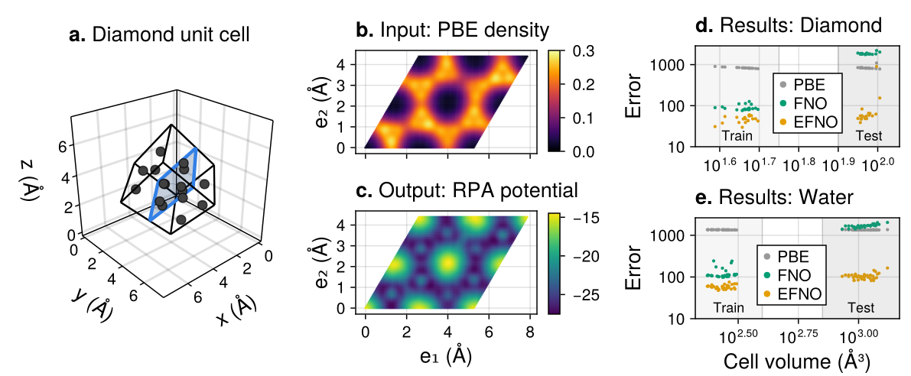

# Euclidean Fourier Neural Operators

[](https://arxiv.org/abs/2608.28425)

> N. Bosch, N. F. Schmitz, M. F. Herbst:
> **Euclidean Fourier Neural Operators**, [arXiv:2608.28425](https://arxiv.org/abs/2608.28425)

This repository contains the code accompanying the paper. It implements the
Euclidean Fourier neural operator (EFNO) and reproduces its two experiments:
transferring a learned convolution across equivalent periodic cells, and
learning exchange-correlation potentials across crystal structures from the
ML-RPA dataset.



## Setup

Install [Julia](https://julialang.org/downloads) (for example via
[juliaup](https://github.com/JuliaLang/juliaup)), then from this directory:

```bash
julia --project=. -e 'import Pkg; Pkg.instantiate()'
```

## Experiment 1: Transferring a learned convolution across equivalent periodic cells

A single FNO and EFNO spectral convolution layer are fitted in closed form to
the heat-kernel symbol on a small rhombic cell and evaluated on an equivalent
rectangular cell and on supercells.

The experiment can be run with
```bash
julia --project=. experiments/exp1_cell_transfer/exp1_cell_transfer.jl
```
which prints Table 3 and writes `figures/fig1_cell_transfer.{pdf,svg}` (Fig. 1).

## Experiment 2: Learning exchange-correlation potentials across crystal structures

**Data.**
Experiment 2 uses the ML-RPA dataset by
[Riemelmoser, Verdi, Kaltak, and Kresse, JCTC 19, 7287 (2023)](https://doi.org/10.1021/acs.jctc.3c00848).
The dataset is not part of this repository (3.4 GB). 
Download the raw `MLPOT` file from [Phaidra](https://phaidra.univie.ac.at/detail/o:1675367) and convert it with

```bash
julia --project=. experiments/exp2_xc_potentials/parse_mlpot.jl /path/to/MLPOT data/mlrpa_dataset.jld2
```

**Training.**
Checkpoints of trained models are provided in `./checkpoints/`.
To re-train the EFNO and FNO, run:

```bash
julia -t 16 --project=. experiments/exp2_xc_potentials/train.jl diamond
julia -t 16 --project=. experiments/exp2_xc_potentials/train.jl diamond model_type=fno
julia -t 16 --project=. experiments/exp2_xc_potentials/train.jl water
julia -t 16 --project=. experiments/exp2_xc_potentials/train.jl water model_type=fno
```

**Evaluation.**
The trained models can then be evaluated with:

```bash
julia --project=. experiments/exp2_xc_potentials/eval.jl
```

which prints Table 1:

```
                              Diamond                          Water
  Model      Train+Val         Test       Train+Val         Test
  PBE           826.67       825.17         1350.66      1348.37
  FNO            84.38      1815.42          108.96      1675.35
  EFNO           47.88        56.11           57.50       103.54
```

writes the per-structure errors to `results/*.csv` and
the slice visualizations of Figs. 3-4 to `figures/`.
Then

```bash
julia --project=. experiments/exp2_xc_potentials/plot_overview.jl
```

reads those per-structure errors and writes Fig. 2.


## Citation

```bibtex
@misc{bosch2026efno,
  title =        {Euclidean {Fourier} Neural Operators},
  author =       {Bosch, Nathanael and Schmitz, Niklas Frederik and Herbst, Michael F.},
  year =         2026,
  eprint =       {2608.28425},
  archivePrefix = {arXiv},
  primaryClass = {cs.LG},
  doi =          {10.48550/arXiv.2608.28425}
}
```

The ML-RPA dataset used in Experiment 2 is due to
[Riemelmoser, Verdi, Kaltak, and Kresse (2023)](https://doi.org/10.1021/acs.jctc.3c00848).

## License

The code in this repository is released under the [MIT license](LICENSE).
